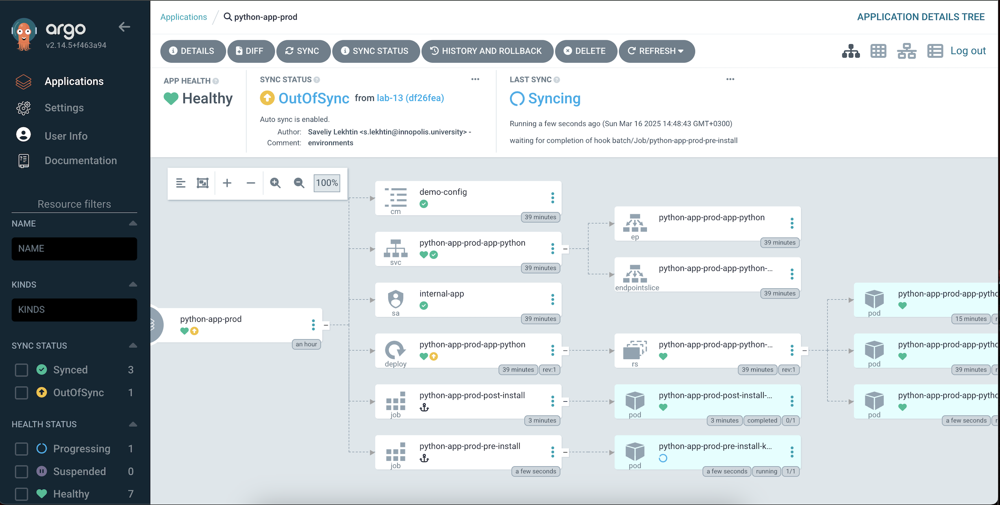
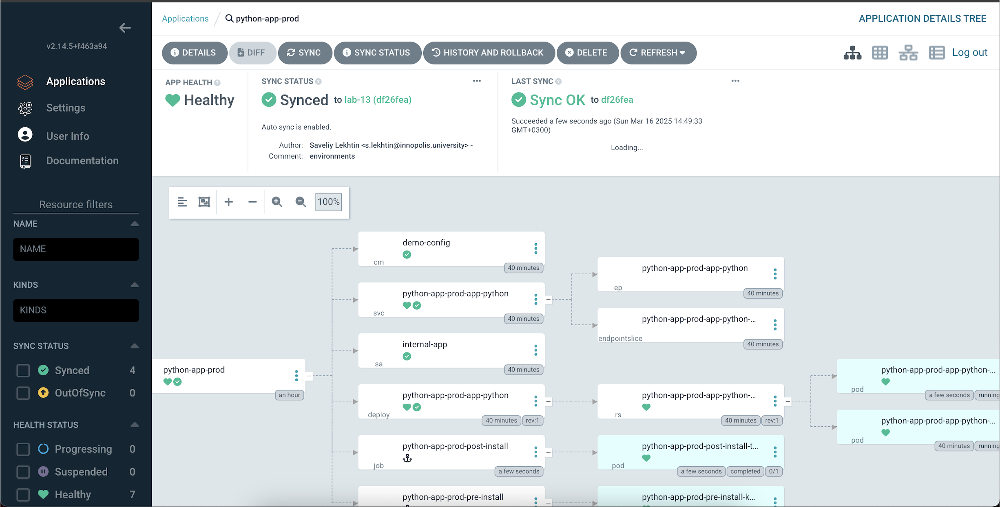

# Overview
ArgoCD lab

## Pod deletion results

As we can deleted pod was recreated

```bash
➜ k8s git:(lab-13) k get pods -n prod
NAME                                          READY   STATUS      RESTARTS   AGE
python-app-prod-app-python-68fd6545bb-kv7cm   1/1     Running     0          15m
python-app-prod-app-python-68fd6545bb-pq8xm   1/1     Running     0          39m
python-app-prod-post-install-tkgpm            0/1     Completed   0          25s
python-app-prod-pre-install-km7gj             0/1     Completed   0          54s
➜ k8s git:(lab-13) k delete pod python-app-prod-app-python-68fd6545bb-kv7cm -n prod
pod "python-app-prod-app-python-68fd6545bb-kv7cm" deleted
➜ k8s git:(lab-13) k get pods -n prod                                              
NAME                                          READY   STATUS      RESTARTS   AGE
python-app-prod-app-python-68fd6545bb-9d8v6   1/1     Running     0          25s
python-app-prod-app-python-68fd6545bb-pq8xm   1/1     Running     0          40m
python-app-prod-post-install-tkgpm            0/1     Completed   0          60s
python-app-prod-pre-instal
```

## Sync status after both tests

Sync Status After Both Tests

1. After Test 1 (Patch Deployment)
The replica count increased.
ArgoCD reported an OutOfSync status.



2. After 2 test (delete pod)
ArgoCD did not detect drift because pod deletions are runtime events, not configuration changes.



## ArgoCD Configuration Drift vs. Runtime Events
ArgoCD differentiates between configuration drift and runtime events, affecting how it reports sync status:

## Configuration Drift
ArgoCD detects and flags changes to resources managed by GitOps.
Examples:
1. Modifying a Deployment spec in Git but not applying it.
2. Changing replica count in Git but not syncing it.
## Runtime Events
1. Events like pod deletions do not cause drift because Kubernetes automatically restores the pod based on the Deployment spec.
2. ArgoCD does not report OutOfSync for these events since they do not change the desired state in Git.