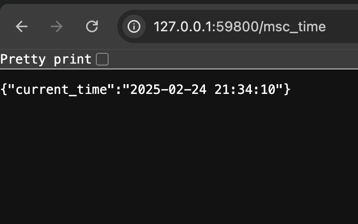
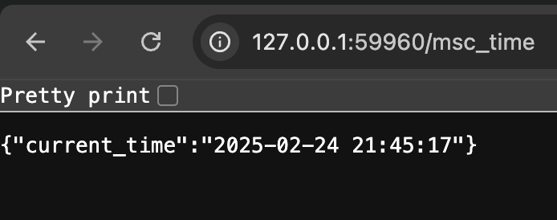

# Introduction to Kubernetes

## Kubernetes Setup and Basic Deployment

```bash
➜ kubectl create deployment --image vtecovsky/app_python:latest app-python --port 8000

deployment.apps/app-python created
```

```bash
➜ kubectl expose deployment app-python --type=LoadBalancer --port=8000

service/app-python exposed
```

```bash
➜ kubectl get svc
NAME         TYPE           CLUSTER-IP   EXTERNAL-IP   PORT(S)          AGE
app-python   LoadBalancer   10.99.1.39   <pending>     8000:31888/TCP   36s
kubernetes   ClusterIP      10.96.0.1    <none>        443/TCP          31m
```

```bash
➜ minikube service app-python
|-----------|------------|-------------|---------------------------|
| NAMESPACE |    NAME    | TARGET PORT |            URL            |
|-----------|------------|-------------|---------------------------|
| default   | app-python |        8000 | http://192.168.49.2:31888 |
|-----------|------------|-------------|---------------------------|
🏃  Starting tunnel for service app-python.
|-----------|------------|-------------|------------------------|
| NAMESPACE |    NAME    | TARGET PORT |          URL           |
|-----------|------------|-------------|------------------------|
| default   | app-python |             | http://127.0.0.1:59800 |
|-----------|------------|-------------|------------------------|
🎉  Opening service default/app-python in default browser...
❗  Because you are using a Docker driver on darwin, the terminal needs to be open to run it.
```

### Running application:

  

### Clean up:
```bash
➜ k delete deployment app-python
deployment.apps "app-python" deleted
➜ k delete service app-python
service "app-python" deleted
```

## Declarative Kubernetes Manifests

```bash
➜ kubectl get pods,svc
NAME                              READY   STATUS    RESTARTS   AGE
pod/app-python-7ffcdbc6bb-fpxx8   1/1     Running   0          3m42s
pod/app-python-7ffcdbc6bb-hjhvt   1/1     Running   0          3m42s
pod/app-python-7ffcdbc6bb-lmw5h   1/1     Running   0          3m42s

NAME                         TYPE        CLUSTER-IP   EXTERNAL-IP   PORT(S)          AGE
service/app-python-service   NodePort    10.99.46.4   <none>        8000:32557/TCP   38s
service/kubernetes           ClusterIP   10.96.0.1    <none>        443/TCP          45m
```

```bash
➜ minikube service --all      
|-----------|--------------------|-------------|---------------------------|
| NAMESPACE |        NAME        | TARGET PORT |            URL            |
|-----------|--------------------|-------------|---------------------------|
| default   | app-python-service |        8000 | http://192.168.49.2:32557 |
|-----------|--------------------|-------------|---------------------------|
|-----------|------------|-------------|--------------|
| NAMESPACE |    NAME    | TARGET PORT |     URL      |
|-----------|------------|-------------|--------------|
| default   | kubernetes |             | No node port |
|-----------|------------|-------------|--------------|
😿  service default/kubernetes has no node port
🏃  Starting tunnel for service app-python-service.
🏃  Starting tunnel for service kubernetes.
|-----------|--------------------|-------------|------------------------|
| NAMESPACE |        NAME        | TARGET PORT |          URL           |
|-----------|--------------------|-------------|------------------------|
| default   | app-python-service |             | http://127.0.0.1:59960 |
| default   | kubernetes         |             | http://127.0.0.1:59962 |
|-----------|--------------------|-------------|------------------------|
🎉  Opening service default/app-python-service in default browser...
🎉  Opening service default/kubernetes in default browser...
❗  Because you are using a Docker driver on darwin, the terminal needs to be open to run it.
```

### Running application:



## Bonus exercise

```bash
➜ k get pods,svc
NAME                              READY   STATUS    RESTARTS   AGE
pod/app-golang-6dcd47d4fd-t487t   1/1     Running   0          11h
pod/app-python-7ffcdbc6bb-fpxx8   1/1     Running   0          11h
pod/app-python-7ffcdbc6bb-hjhvt   1/1     Running   0          11h
pod/app-python-7ffcdbc6bb-lmw5h   1/1     Running   0          11h

NAME                         TYPE        CLUSTER-IP      EXTERNAL-IP   PORT(S)          AGE
service/app-golang-service   NodePort    10.104.145.89   <none>        8080:32706/TCP   11h
service/app-python-service   NodePort    10.99.46.4      <none>        8000:32557/TCP   11h
service/kubernetes           ClusterIP   10.96.0.1       <none>        443/TCP          12h
```

To access my services using ingress, I have to enable ingress addon in minikube and start minikube tunnel

 Python app
```bash
➜  ~ curl --resolve "app-python.local:80:127.0.0.1" -i http://app-python.local/msc_time

HTTP/1.1 200 OK
Date: Tue, 25 Feb 2025 06:33:21 GMT
Content-Type: application/json
Content-Length: 38
Connection: keep-alive

{"current_time":"2025-02-25 09:33:21"}
```

Golang app
```bash
➜  ~ curl --resolve "app-golang.local:80:127.0.0.1" -i http://app-golang.local/msc_time

HTTP/1.1 200 OK
Date: Tue, 25 Feb 2025 06:36:26 GMT
Content-Type: text/plain; charset=utf-8
Content-Length: 69
Connection: keep-alive

{"current_time_in_moscow": "2025-02-25 09:36:26.082366082 +0300 MSK"}
```