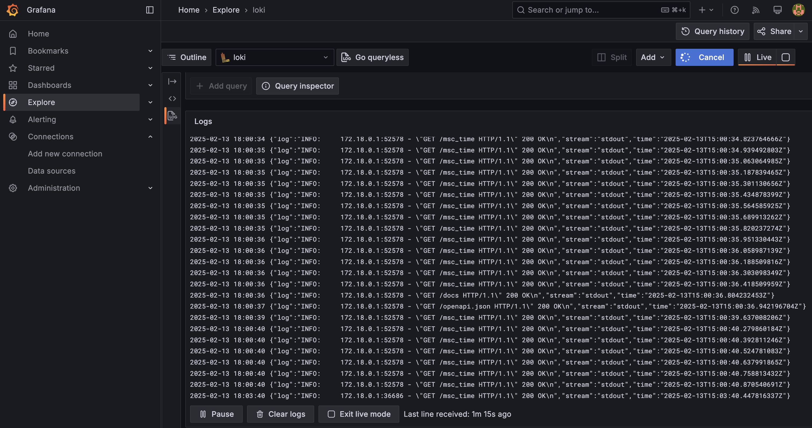
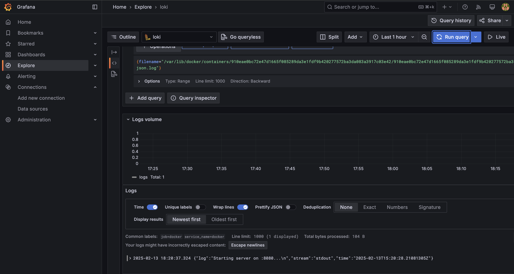
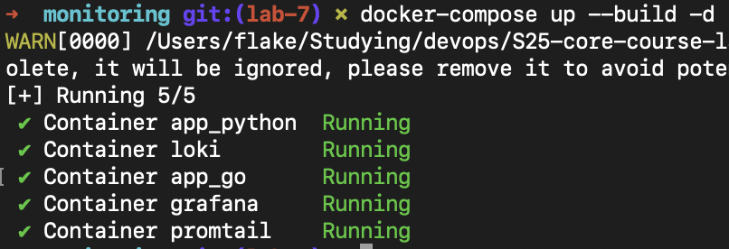

# Overview

This document explains the logging stack setup using Grafana Loki, Promtail, and Grafana. The stack is responsible for collecting, storing, and visualizing logs from Docker containers.

## Components

### 1. Loki (Log Aggregation)

**Role:**
Loki acts as a log database, collecting and indexing logs.

**Configuration:**
- Runs on port `3100`.
- Stores logs using the local filesystem.
- Exposes an API endpoint to receive logs from Promtail.

### 2. Promtail (Log Collector)

**Role:**
Promtail scrapes logs from Docker container log files and sends them to Loki.

**Configuration:**
- Reads logs from `/var/lib/docker/containers/*/*-json.log`.
- Uses a static configuration to label logs for querying in Grafana.
- Uses a position file to track processed logs.

### 3. Grafana (Visualization)

**Role:**
Grafana queries logs from Loki and provides a web-based UI for visualization.

**Configuration:**
- Runs on port `3000`.
- Connects to Loki as a data source.
- Allows querying logs using LogQL.

## Screenshots

### Python App Logs in Grafana  
Logs from the Python application displayed in Grafana.  
  

### Golang App Logs in Grafana  
Logs from the Golang application visualized in Grafana.  
  

### Running Containers (Docker Compose)  
Overview of the running containers in Docker Compose.  
  