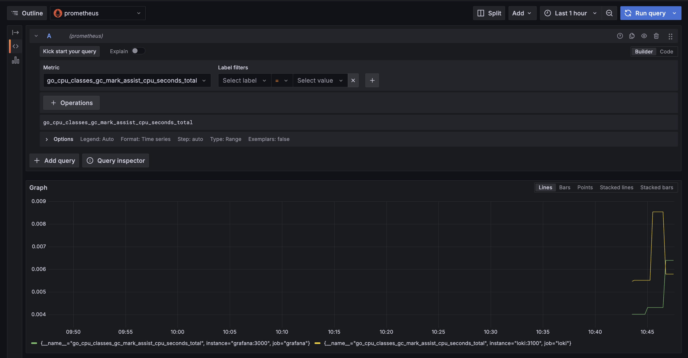

# Logging and Monitoring Stack

This document describes Prometheus integration.

## Screenshots

### Prometheus Targets  
Prometheus successfully scraping targets.  
  

### Loki in Grafana  
Loki dashboard visualized in Grafana.  
  

### Prometheus in Grafana  
Prometheus dashboard metrics visualized in Grafana.  
  

---

## 🛠 Updated `docker-compose.yaml`  

The following update adds **Prometheus** to the logging stack:  

```yaml
prometheus:
    image: prom/prometheus:latest
    container_name: prometheus
    ports:
      - "9090:9090"
    volumes:
      - ./prometheus.yaml:/etc/prometheus/prometheus.yaml
    command:
      - "--config.file=/etc/prometheus/prometheus.yaml"
    networks:
      - loki
    depends_on:
      - loki
    logging:
      driver: "json-file"
      options:
        max-size: "10m"
        max-file: "3"
    deploy:
      resources:
        limits:
          memory: 512M
        reservations:
          memory: 256M
    healthcheck:
      test: ["CMD", "wget", "--spider", "http://localhost:9090/-/healthy"]
      interval: 30s
      timeout: 10s
      retries: 5
```

## Python application metrics export with Prometheus
To integrate Prometheus monitoring in my FastAPI application, I used the `prometheus_client` library to expose an endpoint for scraping metrics.

```python
@router.get("/metrics", response_class=PlainTextResponse)
async def metrics():
    return generate_latest()
```

Output:
 

## Golang application metrics export with Prometheus
To integrate Prometheus monitoring in my golang application, I used the `prometheus` and `prometheus/promhttp` libraries to expose an endpoint for scraping metrics.

Output:
  
