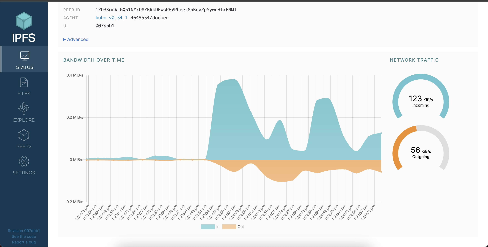

## IPFS
### Network traffic

- Incoming traffic: 123 KiB/S
- Outgoing traffic: 56 KiB/S 
- Number of peers: 186 (might be change)

### Hash

Hash: QmfS3AQTLkMct2UayerU8Yuc9GuWsxWyEvtYe2nJoF4n5V

URL: https://ipfs.infura.io/ipfs/QmfS3AQTLkMct2UayerU8Yuc9GuWsxWyEvtYe2nJoF4n5V (I got 504 status code from server)

## Project on Fleek.xyz

Domain: https://rapid-bird-noisy.on-fleek.app/

IPFS Link: https://gateway-ipfs.fleek.xyz/ipfs/bafybeiansnnvcto3txmhbkczprxslsbtg2hhi7ezw7erj34ljvc4t4a2yu
